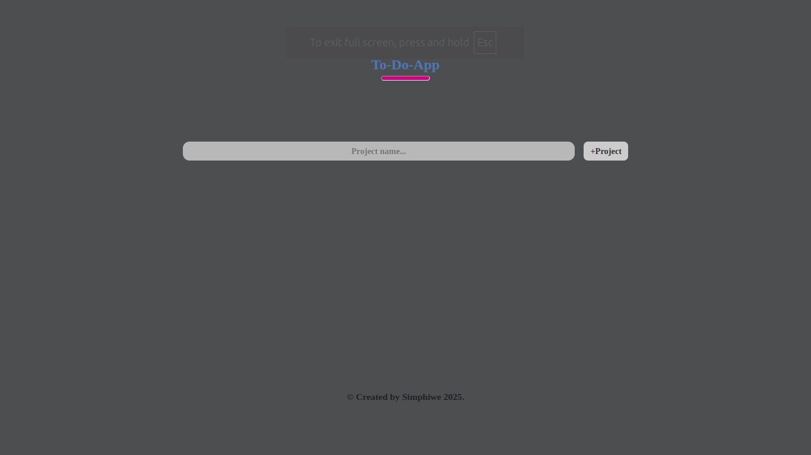
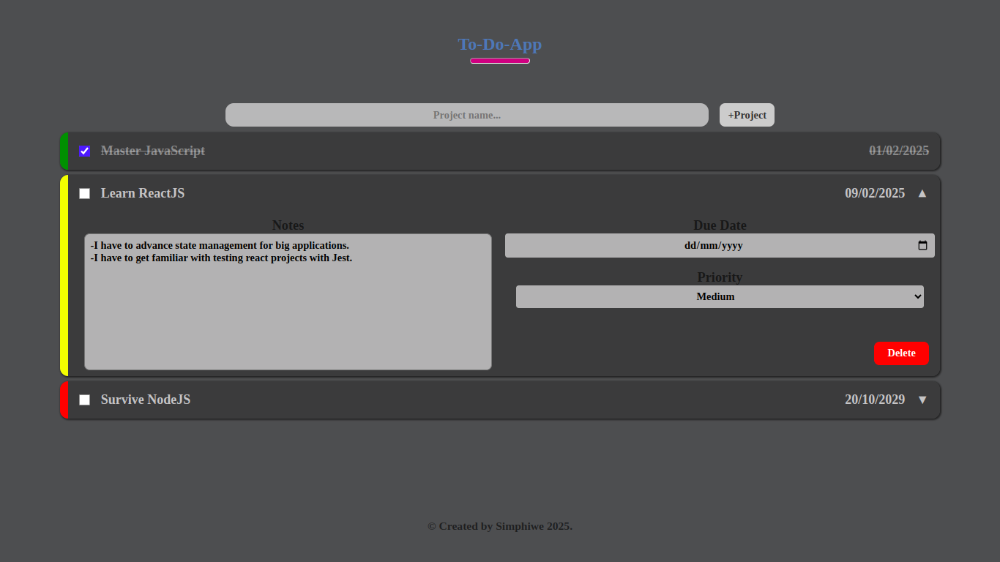

# **To-Do App**

Check it _**LIVE**_ 👉
**<https://deebest.github.io/to-do-app/>**

A simple and intuitive web application for managing your daily tasks and to-dos

## Features

- Add new to-dos with due dates and priorities.
- Include notes and details about each to-do using a textarea.
- Delete to-dos when completed or no longer needed.
- Mark to-dos as completed by checking a checkbox.
- All to-dos and their details are saved to local storage.

## Tech stack used

- GIT
- HTML
- CSS
- JavaScript
- NPM
- Webpack
- Github

## Getting Started

To run the app locally, follow these steps:

### Step 1: Clone the repository

$: **git clone https://github.com/Deebest/to-do-app.git**

### Step 2: Install dependencies

$: **npm install**

### Step 3: Build the app

$: **npm run build**

### Step 4: Start the app

**npm start**

## Contact

Get in touch:

Email : **<simphiwedladla8@gmail.com>**

Linked: **<https://www.linkedin.com/in/dladla-simphiwe-89061a20a/>**

Github: **<https://github.com/DeeBest>**
